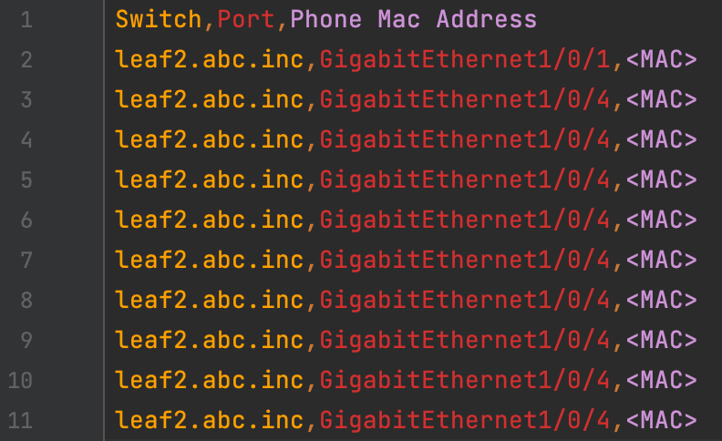
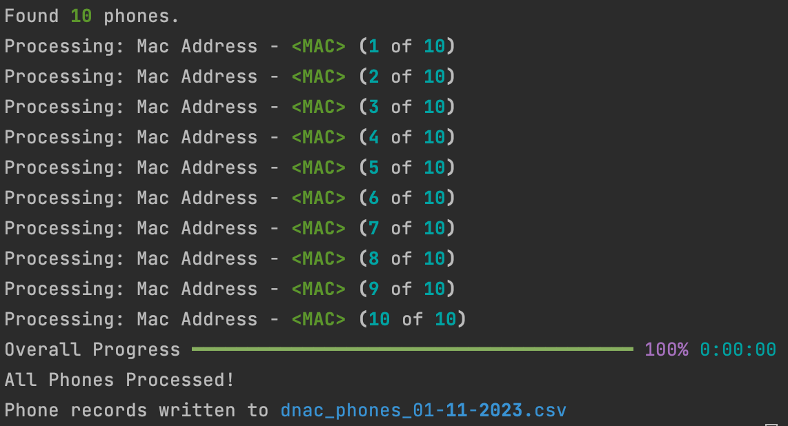

# GVE DevNet DNAC IP Phones to Switch Ports

This script generates a report detailing wired IP Phones and the switches and ports they are connected to in a DNAC environment. The primary use case of these reports is to track changes over time, and, more specifically, to identify unauthorized or accidental movement of phones.

## Contacts
* Trevor Maco

## Solution Components
* DNAC
* Python 3.11

## Prerequisites
### DNA Center API Activation
1. As of Version 1.3.1.0, the Platform and API components of DNAC are enabled by default. Ensure the DNAC instance has at this version or higher before running the script.

### DNA Center Credentials: 
1. In order to use the DNA Center APIs, you need to make note of the IP address, username, and password of your instance of DNA Center. Note these values to add to the credentials file during the installation phase.

## Installation/Configuration
1. Clone this repository with `git clone https://github.com/gve-sw/gve_devnet_dnac_ip_phones_to_switchports`
2. Add the IP address, username, and password that you collected in the Prerequisites section to `config.py` file.
```python
DNAC_BASE_URL = "<ip address or FQDN>"
DNAC_USERNAME = "<username>"
DNAC_PASSWORD = "<password>"
```
3. Set up a Python virtual environment. Make sure Python 3 is installed in your environment, and if not, you may download Python [here](https://www.python.org/downloads/). Once Python 3 is installed in your environment, you can activate the virtual environment with the instructions found [here](https://docs.python.org/3/tutorial/venv.html).
4. Install the requirements with `pip3 install -r requirements.txt`

## Usage
To run the code, use the command:
```
$ python3 app.py
```

This command will generate a date stamped csv file of the format `dnac_phones_[date].csv`, which looks like:



with script output:



From here, the CSV files can be compared manually, with a Linux 'diff' command, or some other comparison method.

* Optional: A cronjob can be created to periodically run `app.py`. Please consult `crontab.txt` for more information.

# Screenshots


### LICENSE

Provided under Cisco Sample Code License, for details see [LICENSE](LICENSE.md)

### CODE_OF_CONDUCT

Our code of conduct is available [here](CODE_OF_CONDUCT.md)

### CONTRIBUTING

See our contributing guidelines [here](CONTRIBUTING.md)

#### DISCLAIMER:
<b>Please note:</b> This script is meant for demo purposes only. All tools/ scripts in this repo are released for use "AS IS" without any warranties of any kind, including, but not limited to their installation, use, or performance. Any use of these scripts and tools is at your own risk. There is no guarantee that they have been through thorough testing in a comparable environment and we are not responsible for any damage or data loss incurred with their use.
You are responsible for reviewing and testing any scripts you run thoroughly before use in any non-testing environment.